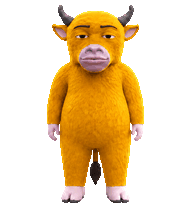
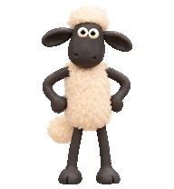

# CodexPet

Codex 自定义宠物。

## 可用宠物

<table>
  <tr>
    <td align="center">
      <br />
      <strong>牛来妈</strong><br />
      <code>niulaima</code>
    </td>
    <td align="center">
      <br />
      <strong>小羊肖恩</strong><br />
      <code>shaun</code>
    </td>
    <td align="center">
      <br />
      <strong>猪猪侠</strong><br />
      <code>zhuzhuxia</code>
    </td>
  </tr>
  <tr>
    <td align="center">
      <br />
      <strong>Pickle Rick</strong><br />
      <code>pickle-rick</code>
    </td>
    <td align="center">
      <br />
      <strong>Doc</strong><br />
      <code>doc</code>
    </td>
  </tr>
</table>

## 安装

1. 下载仓库并进入项目目录：

   ```bash
   git clone https://github.com/RYDE-PLAY/CodexPet.git
   cd CodexPet
   ```

   如果已经下载过仓库，直接进入本地的 `CodexPet` 目录即可。

2. 选择一个宠物。下面以 `niulaima` 为例；将命令中的 `niulaima` 替换成上面任意宠物的 `pet-id`。两个文件需要保持在同一个目录中：

   ```text
   niulaima/
   ├── pet.json
   └── spritesheet.webp
   ```

3. 将它复制到 Codex 宠物目录：

   ```bash
   CODEX_PET_ID="niulaima"
   CODEX_PETS_DIR="${CODEX_HOME:-$HOME/.codex}/pets"
   mkdir -p "$CODEX_PETS_DIR"
   cp -R "pets/$CODEX_PET_ID" "$CODEX_PETS_DIR/"
   ```

4. 复制完成后重启或重新加载 Codex。

## 添加更多宠物

每个宠物放在 `pets/<pet-id>/` 下，并在目录中提供 `pet.json` 和 `spritesheet.webp`。

## 许可

MIT License
